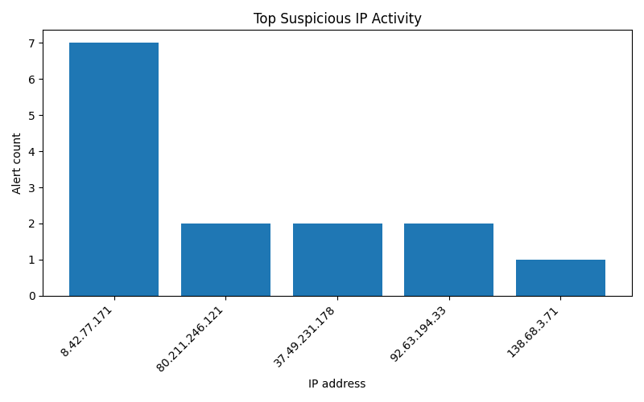

# Итоговое домашнее задание **«Автоматизированный мониторинг и реагирование на угрозы»**
___
## Описание проекта

Данный проект представляет собой простой инструмент на Python для автоматизированного мониторинга угроз информационной безопасности.

Скрипт выполняет следующие задачи:
*  анализирует события сетевой безопасности из логов Suricata
*  выполняет поиск известных уязвимостей через API Vulners
*  выявляет подозрительную активность IP-адресов
*  имитирует реагирование на угрозы
*  отправляет уведомления в Telegram или выполняет их имитацию
*  формирует отчёт и строит график

Проект реализован в рамках итогового домашнего задания по дисциплине «Программирование на Python».
___
## Структура проекта
```
project/
│
├── Final_HW.py
├── Final_HW.ipynb
├── alerts-only.json
├── ip_activity.csv
├── ip_activity.png
├── report.json
└── README.md
```
___

## Среда выполнения

Проект разрабатывался и тестировался в среде **Google Colab**.

Версия Python: **Python 3.12.12**

Большинство используемых библиотек (pandas, matplotlib, requests) уже предустановлены в Google Colab.

___

## Используемые источники данных

В проекте используются два источника данных:

1. Логи **Suricata**

`alerts-only.json`

Логи анализируются для выявления:
* подозрительных IP-адресов
* частых сигнатур атак
* повышенной активности источников трафика

Подозрительным считается IP-адрес, который встречается в логах 3 и более раз.

2. **API Vulners**

Используется API сервиса Vulners для поиска известных уязвимостей.

Скрипт выполняет поиск по ключевым словам:
```text
ssh
vnc
mssql
oracle
mysql
postgresql
snmp
sip
```

Из результатов возвращаются только уязвимости с **CVSS ≥ 7.0.**
___
## Используемые библиотеки

* requests
* pandas
* matplotlib
___

## Быстрый запуск

1. Установить зависимости

```bash
pip install requests pandas matplotlib
```
2.	Задать API-ключ Vulners
```python
import os
os.environ["VULNERS_API_KEY"] = "ваш_ключ"
```
3.	Для получения уведомлений в Telegram
```python
os.environ["TELEGRAM_TOKEN"] = "ваш_токен"
os.environ["TELEGRAM_CHAT_ID"] = "ваш_chat_id"
```
4. Запустить скрипт
```bash
python Final_HW.py
```
___
## Запуск в Google Colab

Проект можно запускать в Google Colab.

В этом случае переменные окружения можно задать прямо в ячейке ноутбука:
```python
import os

os.environ["VULNERS_API_KEY"] = "ваш_ключ"
os.environ["TELEGRAM_TOKEN"] = "ваш_токен"
os.environ["TELEGRAM_CHAT_ID"] = "ваш_chat_id"
```
После этого можно запускать основной код.
___

## Реагирование на угрозы

При обнаружении подозрительных IP выполняется:
* вывод сообщения о потенциальной угрозе
* имитация блокировки IP-адреса
* отправка уведомления в Telegram

Если Telegram-токен не задан, выполняется имитация отправки уведомления.

Пример сообщения:
```
🚨 КРИТИЧЕСКАЯ УГРОЗА ОБНАРУЖЕНА!
Источник: Suricata logs
IP: 8.42.77.171
Количество событий: 7
Сигнатура: ET SCAN Potential SSH Scan
Действие: имитация блокировки IP
```
___
## Формирование отчёта

После выполнения анализа создаются следующие файлы:

`report.json` - JSON-отчёт с результатами анализа

`ip_activity.csv` - список подозрительных IP-адресов, прошедших заданный порог

`ip_activity.png` - график топ-5 IP-адресов по количеству событий
___

## Результат работы

Пример вывода программы:
```text
Запуск мониторинга угроз

🔎 Поиск критичных уязвимостей через Vulners

Загружено событий: 44
Уникальных IP: 35

🚩 Подозрительные IP:
8.42.77.171: 7 событий

📡 Частые сигнатуры атак:

alert.signature
ET DROP Dshield Block Listed Source group 1      2
ET SCAN Potential VNC Scan 5800-5820             1
ET SCAN Potential SSH Scan                       1
ET SCAN Sipvicious Scan                          1
ET SCAN Suspicious inbound to MSSQL port 1433    1
Name: count, dtype: int64

[ACTION] Имитация блокировки IP 8.42.77.171

[ИМИТАЦИЯ TELEGRAM]
🚨 КРИТИЧЕСКАЯ УГРОЗА ОБНАРУЖЕНА!
Источник: Suricata logs
IP: 8.42.77.171
Количество событий: 7
Сигнатура: ET SCAN Potential SSH Scan
Действие: имитация блокировки IP


Отчёт сохранён:
report.json
ip_activity.csv
График сохранён: ip_activity.png

Анализ завершён
```
___

# Вывод

В рамках работы был разработан прототип системы автоматизированного мониторинга угроз информационной безопасности.

Реализованный инструмент объединяет анализ сетевых событий, полученных из логов Suricata, и поиск известных уязвимостей через внешний API сервиса Vulners.  

Скрипт позволяет выявлять подозрительную активность IP-адресов, имитировать реагирование на инциденты безопасности и автоматически формировать отчётность.

В результате работы реализовано решение, которое демонстрирует базовые принципы автоматизации задач мониторинга безопасности:
* анализ событий сетевой безопасности
* интеграция с внешними источниками уязвимостей
* выявление подозрительной активности
* имитация реагирования на инциденты
* формирование отчётов и визуализация результатов

Полученный инструмент может рассматриваться как упрощённая модель системы мониторинга безопасности и демонстрирует возможности использования Python для автоматизации задач информационной безопасности.

## График результата


