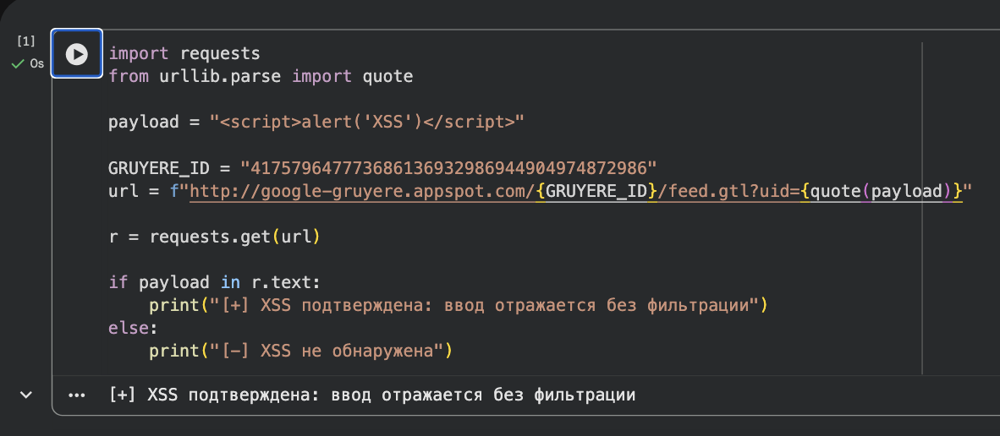

# ДЗ 10. Python для аналитиков ИБ: эксплойты

## Описание уязвимости

CVE-2010-4494 — XSS-уязвимость в учебном приложении Google Gruyere.

---
## Пример результата
[+] Потенциальная уязвимость обнаружена

