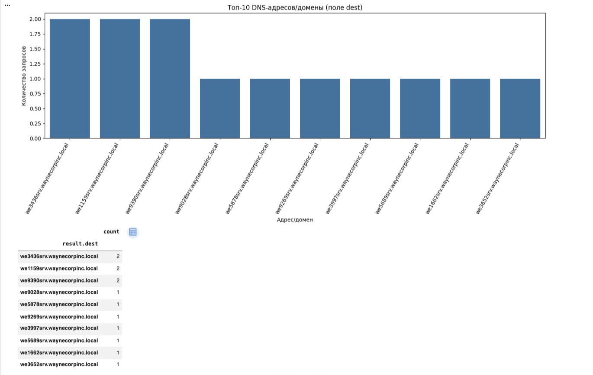
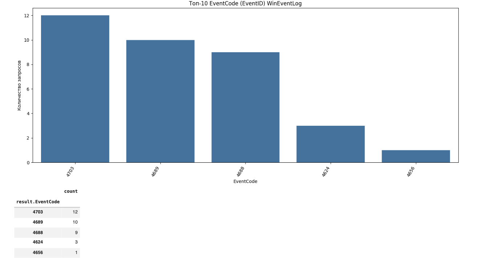

# ДЗ 11. Python для аналитиков ИБ: поиск негативных событий

## Файлы в репозитории
- `hw11.py` — основной скрипт анализа и построения графиков
- `botsv1.json` — исходные данные
- `Screenshot 1.png`
- `Screenshot 2.png`

## Что сделано
1. Загружен файл `botsv1.json`.
2. Данные преобразованы в таблицу через `pandas.json_normalize`.
3. Построены 2 графика.

## Результаты

