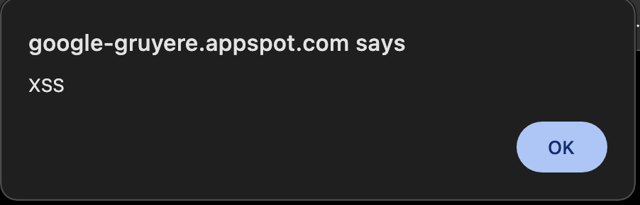

# ДЗ 8. Взаимодействие в WWW: взаимодействие с сервисами

## Цель работы

Целью данного домашнего задания было изучение перехвата и
анализа сетевого трафика с использованием библиотеки Scapy,
а также анализ HTTP-запросов при эксплуатации XSS-уязвимостей
на примере учебного веб-приложения Google Gruyere.

---

## Файлы проекта

- `scapy_analyzer.py` — Python-скрипт для отправки HTTP-запросов,
  перехвата и анализа сетевого трафика
- `traffic.pcap` — файл с перехваченным сетевым трафиком
- `README.md` — описание выполненной работы
- `xss_alert.png` - скриншот всплывающего окна XSS-атаки в адресной строке

---

## Перехват сетевого трафика

Перехват HTTP-трафика осуществлялся с помощью библиотеки Scapy
на 80 порту (tcp port 80).

Команда для запуска перехвата:

```bash
sudo python3 scapy_analyzer.py --capture --timeout 60 --output traffic.pcap
```

В результате выполнения скрипта были успешно перехвачены HTTP-пакеты,
которые сохранены в файл traffic.pcap.

## Анализ HTTP-сообщений

В ходе анализа перехваченного трафика были обнаружены HTTP-запросы
и ответы, содержащие данные, передаваемые между клиентом
и сервером Google Gruyere.

Пример перехваченного HTTP-запроса (первые 300 символов):

GET /<ID>/feed.gtl?uid=%3Cscript%3Ealert(XSS)%3C/script%3E HTTP/1.1
Host: google-gruyere.appspot.com
User-Agent: curl
Accept: */*

Пример HTTP-ответа сервера:

HTTP/1.1 200 OK
content-type: text/html
cache-control: no-cache

Также в теле ответа присутствует отражённый XSS-пэйлоад:

"<script>alert(XSS)</script>"

Всплывающее окно используется как наглядный индикатор
успешного выполнения внедрённого JavaScript-кода.



## Работа с файлом traffic.pcap

Файл traffic.pcap содержит перехваченные сетевые пакеты.

Файл прилагается в качестве результата выполнения задания
и подтверждает факт перехвата HTTP-трафика и анализа XSS-запросов.

## Вывод

В ходе выполнения домашнего задания были получены базовые навыки
работы с библиотекой Scapy, перехвата и анализа сетевого трафика.

Были успешно перехвачены и проанализированы HTTP-запросы и ответы,
содержащие XSS-пэйлоады, что подтверждает возможность анализа
HTTP-трафика на уровне сети при использовании незашифрованного соединения.