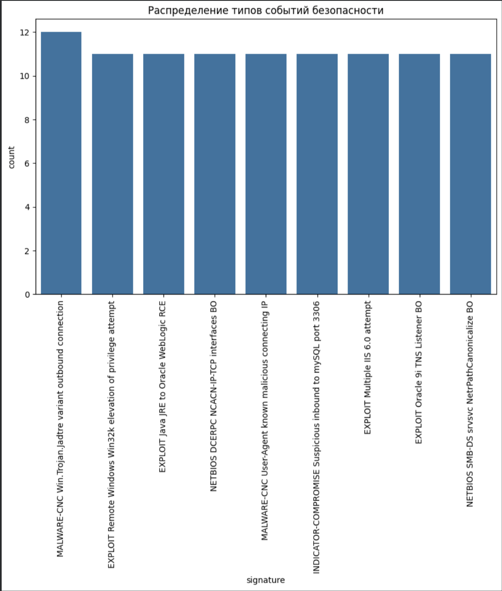

# ДЗ 9. Python для аналитиков ИБ: API и анализ данных

## Описание работы

В рамках домашнего задания был выполнен анализ событий
информационной безопасности с использованием языка Python.

Целью задания являлось освоение базовых приёмов обработки данных
и их визуализации с применением библиотек Pandas, Matplotlib и Seaborn.

---

## Файлы проекта

- `events.json` — файл с событиями информационной безопасности
- `data_table.py` — скрипт для анализа и визуализации данных
- `Data_table.ipynb` — ноутбук с выполнением задания
- `Table.png` — скриншот таблицы с загруженными данными
- `README.md` — описание выполненной работы

Также была сформирована таблица с загруженными данными, ниже
представлен скриншот полученной таблицы:

